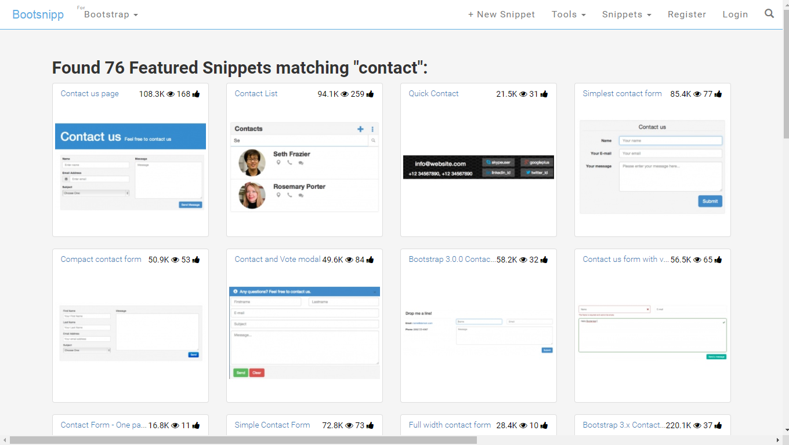

Few tools we rarely use and we dont want to install an application for one time use. Also sometimes we may be using a restricted machine where we cannot install softwares(of course i am telling about offices). At such times, I find the following tools handy. 

Please leave a comment, if I have missed out your favourite online tool.

## Web Designing Tools

Following are the list online tools used for prototyping websites and reusing readily available bootstrap based components

### LayoutIt
[LayoutIt! - Interface Builder for Bootstrap](http://www.layoutit.com) - Website prototype generator using Bootstrap.

### Bootsnipp
[Bootsnipp](https://bootsnipp.com/) is an element gallery for web designers and web developers using Bootstrap.

## UML Designing Tools

### Gliffy
[Gliffy Online](http://www.gliffy.com/) or [Gliffy Chrome App](https://chrome.google.com/webstore/detail/gliffy-diagrams/bhmicilclplefnflapjmnngmkkkkpfad?hl=en)

### Draw.io
[draw.io](https://www.draw.io/) 

### Web Sequence Diagrams
[Web Sequence Diagrams](https://www.websequencediagrams.com/) is an online tool to easily create Sequence diagrams using plain english.

## Miscellaneous

### Full Screen Capture

[Full Screen Capture](https://chrome.google.com/webstore/detail/full-page-screen-capture/fdpohaocaechififmbbbbbknoalclacl) is a chrome extension to save the whole web page as a single image. Its just awesome. You should try it.

### FreeFormatter
[FreeFormatter](http://www.freeformatter.com/) hosts a suite of online tools which includes several formatters, validators, code minifiers, string escapers, encoders and decoders, message digesters, web resources and more.

