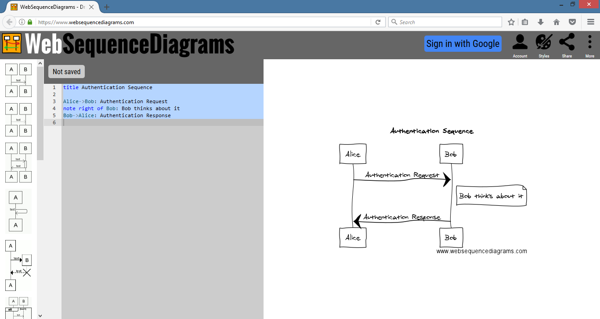

## Web Designing

Following are the list online tools used for prototyping websites and reusing readily available bootstrap based components

### LayoutIt
[LayoutIt! - Interface Builder for Bootstrap](http://www.layoutit.com) - Website prototype generator using Bootstrap.

### Bootsnipp
[Bootsnipp](https://bootsnipp.com/) is an element gallery for web designers and web developers using Bootstrap.

## FreeFormatter
[FreeFormatter](http://www.freeformatter.com/) hosts a suite of online tools which includes several formatters, validators, code minifiers, string escapers, encoders and decoders, message digesters, web resources and more.

## UML Designing

### WebSequenceDiagrams
[Web Sequence Diagrams](https://www.websequencediagrams.com/) is an online tool to easily create Sequence diagrams using plain english.

