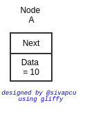
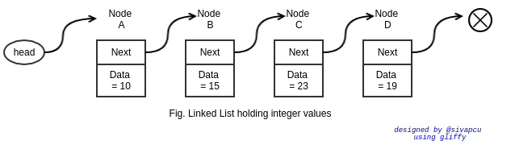

Linked List is a non-contiguous data structure created with each element pointing to next element in the list.

## Node

Each element(generally called as `Nodes`) essentially holds two pieces of information 

1. `data` - value that is supposed to hold in the data structure &
2. `next` - a pointer/reference to the next node in the list

This can be visualized as shown below.

Say for example, if our linked list is to hold integers, then the data will be of type integer, for eg, 10 as shown below.

We can have lots of these nodes, each of them consisting of exactly 

* data (information we want to hold) and 
* next (a pointer, pointing to memory location of the next node in the list).

As you can see, in the above image

* Node A `points to` Node B
* Node B `points to` Node C
* Node C `points to` Node D

So we got our list. To navigate through the list, we should start somewhere. By definition, we start our list using a pointer called `head` which points to the first node in the list. And we exit our list when there are no further nodes. In the image below, since there are no nodes after `Node D`, the `next` pointer points to null.

Using the `head` pointer we got two things
1. `head.data` - data in the first node &
2. `head.next` - a pointer to the next element in the list

Considering the image above, as specified earlier, `head` points to `A`

* which implies `head.data = 10` and `head.next = B`
* which implies `head.next.data = 23` and `head.next.next = C`
* which implies `head.next.next.data = 17` and `head.next.next.next = D`
* which implies `head.next.next.next.data = 35` and `head.next.next.next.next = null`

But when using our linked list, we are not going to use the f**king `next.next.next.....` notation. We will start at the head and move further using temporary pointers, rather than sitting at head and asking next.next.next... 

!!! Attention
    Although in our examples we are holding integer in `data`, in reality `data` also is a pointer (i.e., a variable pointing to an object in the heap)

!!! Tip
    When you are solving problems on linked list, have a similar sketch so that it will be easy to think about the operations

Before discussing further, lets write the basic skeleton of our LinkedList. And even before that lets see how a node looks like in code.

### Node.java

1. We define Node class with Generic type because in real world, the linked list may hold any type of data for eg., Integer, Person, Vehicle etc.,
2. Our node has two variables
    1. data - of type E
    2. next - reference(pointer) to the next Node<E>

Now that, we defined a node, lets use this code to create linkedlist.

### LinkedList.java

1. `Node` class will be made as an inner class of `LinkedList` class because we dont want others to mess up with the `data` and more importantly the `next` pointers. Now the only thing that can access the inner class is the methods of the outer class.
2. We will define a variable `head` of type `Node<E>` to know the starting node of the LinkedList.
3. We will define an additional variable `currentSize` of type `int` to hold the size of the LinkedList. If we dont create this variable, every time we need the size of the list, we have to iterate throught each element and count the number of nodes, whose complexity is O(n) (actually theta(n), because exactly n elements to count). We can avoid this overhead by defining this variable and incrementing its value whenever a node is added or decrementing its value whenever a node is deleted. Now the complexity of this operation is O(1).
4. And Operations like
    1. addFirst()
    2. addLast()
    3. removeFirst()
    4. removeLast()
    5. remove()
    6. contains()

## LinkedList Operations
### Without tail reference
#### addFirst

#### addLast

#### removeFirst

#### removeLast

#### remove

#### contains

### With tail reference
#### addFirst
This is same as without tail reference

#### addLast

#### removeFirst

#### removeLast

#### remove

#### contains
